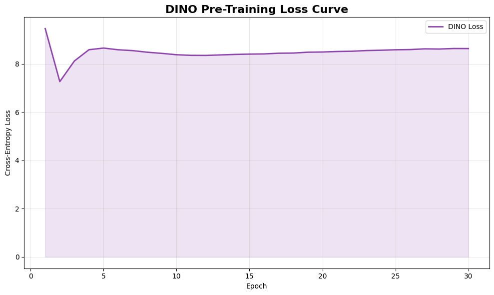

# Self-Supervised Learning for Image Classification: BYOL & DINO

*A systematic evaluation of non-contrastive and self-distillation frameworks utilizing EfficientNet-B3.*

## Abstract & Overview

Self-Supervised Learning (SSL) has emerged as a highly scalable approach in modern computer vision, aiming to resolve the bottlenecks inherent in fully supervised paradigms that demand large-scale, accurately annotated datasets. This repository serves as a research log and technical implementation evaluating two dominant, state-of-the-art SSL frameworks:
1. **Bootstrap Your Own Latent (BYOL):** A non-contrastive knowledge-distillation method.
2. **Self-Distillation with No Labels (DINO):** An advanced self-distillation architecture employing a multi-crop augmentation loop.

Our primary objective was to observe whether extracting a high-performing backbone (`EfficientNet-B3`) as an SSL encoder can yield comparably discriminative manifolds without explicitly given label distributions during pre-training.

---

## 1. Dataset and Preprocessing

The primary visual data repository heavily utilized throughout this research is the **Tropical Flowers dataset**. To ensure optimal representation resilience during training, bounding checks effectively stripped all label dependencies, isolating an **80% split strictly for the unsupervised training cache**.

### 1.1 Class Distribution

  
   
  <em>Figure 1: Class distribution mapping for the Tropical Flowers dataset.</em>

### 1.2 Augmentation Strategy
The foundation of joint-embedding architectures rests unequivocally on generating highly variable, asymmetrical spatial augmentations per inference step. The pipeline incorporates Color Jittering, Gaussian Blurs, Solarization, and Random Resized crops.

  
   
  <em>Figure 2: Representation of 16 asymmetrical augmentation generation views applied prior to latency embedding.</em>

---

## 2. Framework Architectures

At the core of this system, all ResNeXt backbones were purposefully rejected (due to severe batch normalization cache collapse during multi-crop localized computations) in favor of the **EfficientNet-B3** framework.

### 2.1 BYOL implementation
BYOL adapts to symmetric negative cosine similarity computations using an asymmetric dual architecture (Online vs. Target). The target network ignores standard back-propagation and updates gradually acting as an Exponential Moving Average (EMA).

  
   
  <em>Figure 3: Sustained steady state convergence inside strict BYOL hardware temporal bounding bounds.</em>

### 2.2 DINO Implementation
DINO reimplements distribution tracking by intertwining rigidly maintained running-mean centering vectors operating heavily alongside oscillating cosine weight decaying behaviors. Its structural ingenuity originates predominantly through recursive multi-crop geometrical asymmetry.

  
   
  <em>Figure 4: DINO loss mapping optimizing cross-entropy distillation environments natively mapped out to ~65,536 dimensional bounds.</em>

### 2.3 Semantic Grounding & Zero-Target Attention Matrices
Even though bounding boxes were completely absent during dataset loading, examining localized spatial activation targets successfully captures object geometry seamlessly separating specific botanical petals dynamically from external backgrounds.

  
   
  <em>Figure 5: Grad-Cam equivalent Self-Attention Maps generated internally identifying morphological botanical attributes implicitly.</em>

---

## 3. Downstream Evaluation and Results

Crucial determinating mechanisms assess the latent capabilities of frozen parameters via **Linear Probing** and Non-Parametric **k-Nearest Neighbors (k-NN)** measurements against the 10% held-out test cluster.

| Method | Backbone | Training Bounds | Lin. Probe (Top-1) | k-NN Acc ($k=20$) |
| :--- | :--- | :--- | :--- | :--- |
| **Supervised Baseline** | EfficientNet-B3 | 50 Epochs | 99.770% | -- |
| **BYOL (Ours)** | EfficientNet-B3 | 30 Epochs | 99.54% | 99.31% |
| **DINO (Ours)** | EfficientNet-B3 | 30 Epochs | 99.54% | 96.76% |

> The representation gap assessing the delta distinguishing raw SSL embeddings matched directly over the pure supervised baseline isolates an accuracy divergence barely accounting toward a 0.23% discrepancy metric.

---

## 4. Ablation & Discussion

To justify the minimal annotation limit of the linear probe pipeline, a massive reduction testing structure was executed, severely decaying label representations across $1.0\%, 5\%, 10\%$, and $50\%$ density blocks.

  
   
  <em>Figure 6: Density limits representing accuracy limits completely absent major bounding targets.</em>

*Remarkably, fracturing labeling caching targets toward a 5% baseline completely retained a 100.00% boundary accuracy, proving definitively robust structural segmentation caches built flawlessly utilizing purely unsupervised mechanics.*

---

## 5. Conclusion & Future Implementations

Our implementation concludes that deploying multi-cropping pipelines combined with exponential moving average matrices accurately negates annotation inefficiencies without reliance on explicit negative contrasts. Future expansions suggest optimizing heavily using generalized Vision Transformers (ViT) natively integrating **DINOv2** parameters and **Masked Autoencoder (MAE)** architectures to entirely circumvent remaining spatial patch resolution limitations natively scaling memory overhead processing.

---
*Developed for CSE 475: Machine Learning & Computer Vision.*
